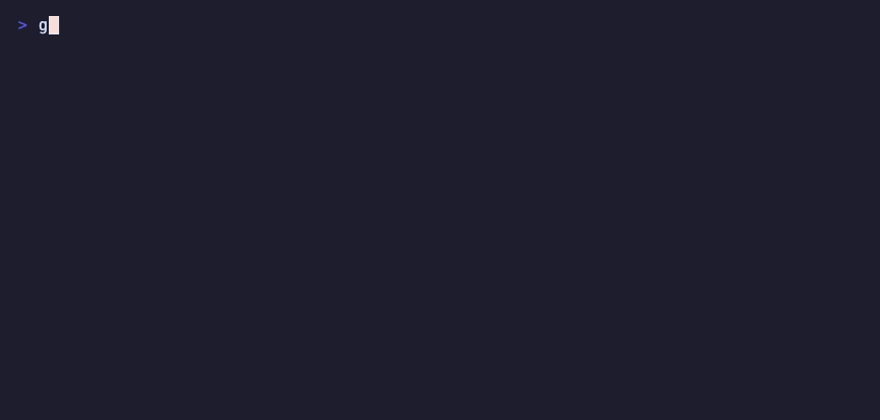

# GridPin

**A country in a file — offline forward and reverse geocoding.**



[GridPin](https://gridpin.dev) is an offline geocoder: a country in a data file, memory-mapped and ready in milliseconds, with no server, no database import, and no network. It resolves addresses to coordinates (forward) and coordinates to the nearest indexed address (reverse — approximate: streets are indexed by centroid, so each result carries its `distance_m`). On a single arm64 laptop core, measured on the France sheet: exact address lookups run at ~3,000/s, reverse geocoding at ~1,800/s, and typo-tolerant fuzzy matching much slower — tens of milliseconds per query, so batch it across cores when you feed it messy input. The engine and every query run fully offline — not a byte of what you geocode leaves your machine; the only network step is you downloading a sheet yourself, and a downloaded sheet carries no query data. Because you compute results locally from openly licensed data, you may store them forever, which hosted geocoding APIs typically forbid. If you have considered self-hosting Nominatim (a beefy server, days of import) or an on-prem geocoder license, the alternative here is: download one file, open it on any laptop.

## Install

**CLI** — prebuilt binaries for Linux x86_64 (`x86_64-unknown-linux-gnu`),
macOS Apple Silicon (`aarch64-apple-darwin`) and Windows x86_64
(`x86_64-pc-windows-msvc`) are attached to every
[GitHub release](https://github.com/gridpin/gridpin/releases); other targets
(Intel macOS, Linux arm64/musl, Windows arm) build from source:

```console
$ base=https://github.com/gridpin/gridpin/releases/download/v0.1.0
$ curl -fsSLO "$base/gridpin-aarch64-apple-darwin.tar.gz"
$ curl -fsSLO "$base/gridpin-release-signers"
$ curl -fsSLO https://dl.gridpin.dev/v0.1.0/attestation.json
$ curl -fsSLO https://dl.gridpin.dev/v0.1.0/attestation.json.sig
# the trust root comes from the OTHER channel — see "Verifying a release" for why
$ ssh-keygen -Y verify -f gridpin-release-signers -I gridpin-release \
    -n gridpin-g02 -s attestation.json.sig < attestation.json \
    || { echo "signature does not verify — STOP"; exit 1; }
$ want=$(python3 -c 'import json;print([a["sha256"] for a in json.load(open("attestation.json"))["assets"] if a["name"]=="gridpin-aarch64-apple-darwin.tar.gz"][0])')
$ test "$want" = "$(shasum -a 256 gridpin-aarch64-apple-darwin.tar.gz | cut -d' ' -f1)" \
    || { echo "archive does not match the signed attestation — STOP"; exit 1; }
$ tar xzf gridpin-aarch64-apple-darwin.tar.gz && sudo mv gridpin /usr/local/bin/
```

Yes, that is longer than `curl | tar`. Unpacking an archive runs its contents sooner or later, and
a checksum published beside the file it describes proves only that the download was not truncated —
whoever can replace one can replace both. The four extra lines are what makes it a check.

Or build from source with stable Rust: `cargo build --release --manifest-path gridpin/Cargo.toml`.

**Python** — `pip install gridpin` (pre-release: currently a 0.0.1 name-reservation stub). This one
rests on PyPI's own integrity, not on the signature above: the attestation covers the artifacts we
publish ourselves. If you need the signed chain, take the wheel from the GitHub release and verify
it the same way as the CLI archive.

**DuckDB** — once accepted into the community catalog: `INSTALL gridpin_ext FROM community;`.
Until then, download `gridpin_ext-<platform>.zip` from the releases page. It is a loadable
extension, so authenticate it before you load it — same three lines as the CLI archive above,
with `gridpin_ext-<platform>.zip` as the asset name:

```console
$ ssh-keygen -Y verify -f gridpin-release-signers -I gridpin-release \
    -n gridpin-g02 -s attestation.json.sig < attestation.json \
    || { echo "signature does not verify — STOP"; exit 1; }
$ want=$(python3 -c 'import json;print([a["sha256"] for a in json.load(open("attestation.json"))["assets"] if a["name"]=="gridpin_ext-osx_arm64.zip"][0])')
$ test "$want" = "$(shasum -a 256 gridpin_ext-osx_arm64.zip | cut -d' ' -f1)" \
    || { echo "extension does not match the signed attestation — STOP"; exit 1; }
```

Then unzip it and `LOAD` the extracted `gridpin_ext.duckdb_extension` in a `duckdb -unsigned`
session — keep
that basename, DuckDB derives the entry symbol from it.

## Quick start

### CLI

```console
# forward: address -> coordinates, top 3 candidates
$ gridpin query france.bin "1 rue de la Paix Paris" -k 3

# reverse: coordinates -> nearest indexed address (approximate; each hit carries distance_m)
$ gridpin reverse france.bin 48.8686 2.3305

# batch: JSONL in ({"q": "..."} per line), JSONL out
$ gridpin batch france.bin queries.jsonl results.jsonl -k 1
```

### Python

```console
$ pip install gridpin
```

> Pre-release: the `gridpin` package on PyPI is currently a 0.0.1 name-reservation stub — the working wheel ships with v0.1; see [Status](#status--roadmap).

```python
import gridpin

g = gridpin.Geocoder("france.bin")
g.geocode("1 rue de la Paix Paris", 1)
g.reverse(48.8686, 2.3305, 1)
```

The wheel wraps the Rust engine directly (pyo3/maturin); on a single core, exact lookups run at ~3,000/s, while typo-heavy input is fuzzy-matched at tens of milliseconds per query — use `geocode_many()` to batch across cores.

### DuckDB

The `gridpin_ext` extension exposes five functions: `gridpin_load`, `gridpin_load_poi` (optional POI layer), `gridpin_reset`, `gridpin_geocode`, `gridpin_reverse`. One country per session — the loaded path may not change while it is loaded (a different path is an error, so a path column can never swap the index in the middle of a running query); to switch countries run `SELECT gridpin_reset();` (a standalone statement — it refuses to run inside a multi-row query) and load the new sheet. The loaded sheet is shared by every connection to the same database process: coordinate switches externally when several connections query concurrently.

```sql
LOAD gridpin_ext;
SELECT gridpin_load('france.bin');
SELECT gridpin_geocode(address)  FROM orders;
SELECT gridpin_reverse(lat, lon) FROM pings;
```

## Countries & data

A country in a file — most countries are a single file (a few regional datasets add a small companion file, and the optional POI layer is its own file). We call a country file a *sheet*, the full set an *atlas*, and a monthly data release *fresh sheets*.

| Country     | File size | Addresses | Source              | Data license          | POI layer |
|-------------|-----------|-----------|---------------------|-----------------------|-----------|
| France      | 365 MB    | 26.1 M    | BAN (national registry) | Licence Ouverte   | ✓ (231 MB, optional) |
| Italy       | 247 MB    | 25.9 M    | Overture / ANNCSU   | CC BY 4.0             | — |
| Netherlands | 103 MB    | 9.9 M     | Overture / NGR (BAG) | Public Domain Mark 1.0 | — |
| Serbia      | 32 MB     | 2.6 M     | Overture / RGZ      | data.gov.rs Terms     | — |

POI coverage is per-country (see the table; we ship a layer only where source data is rich
enough to help). For France, pass the layer and
the engine cascades automatically — address index first, POI only on weak results, exact
addresses never overridden: `gridpin query france.bin "pharmacie gare de Lyon" --poi fr_poi.bin`
or `gridpin.Geocoder("france.bin", poi="fr_poi.bin")`.

The cascade precedence, identical for free-form and structured input:

| Address answer | POI answer | Winner |
|---|---|---|
| confident (e.g. exact house match) | — (not consulted) | address |
| weak (city-level / low confidence / weak fuzzy) | more confident | POI, flagged `poi_layer` |
| weak | equal or less confident | address (ties keep the address) |
| empty | any hit | POI, flagged `poi_layer` |
| empty | empty / no layer loaded | empty |

Structured input feeds EVERY provided token to the POI escalation, joined in the canonical
`street number postcode city` order — a number is often part of a place name ("Studio 54"). The
two input styles agree on the winner for address resolution and for POIs whose tokens are in that
canonical order. They can differ only when the fields you supply reorder the words of an
order-sensitive POI *name* (splitting "54 Studio" into `street:"studio", number:"54"` re-forms it as
"Studio 54"); pass such a query as free-form to keep the original word order.

Sizes are for the current v7 builds (2026-08); the exact byte sizes are checked against a pinned source of truth in CI. A sheet is smaller than its own raw source: France's registry download is an 885 MB gzip that unpacks to 4.9 GB of CSV, while the finished sheet — the same 26.1M addresses plus every index (typo automata, spatial cells, ranking) — is 365 MB, ready to query.

**Download sheets.** Free builds of all available countries are served as individual files —
there is no directory listing, so link straight to the object you want:
[`france.bin`](https://dl.gridpin.dev/v0.1.0/france.bin) (365 MB),
[`italy.bin`](https://dl.gridpin.dev/v0.1.0/italy.bin) (247 MB),
[`netherlands.bin`](https://dl.gridpin.dev/v0.1.0/netherlands.bin) (103 MB),
[`serbia.bin`](https://dl.gridpin.dev/v0.1.0/serbia.bin) (32 MB), plus the optional France POI layer
[`fr_poi.bin`](https://dl.gridpin.dev/v0.1.0/fr_poi.bin) (231 MB). The matching `SHA256SUMS` manifest (covering the
engine binary and every sheet) is on the [GitHub release](https://github.com/gridpin/gridpin/releases).
Subscribers fetch fresh monthly builds from a keyed URL instead — see
[gridpin.dev/docs](https://gridpin.dev/docs.html).

## Quality

**Where the truth is the national registry, GridPin is exact.** On France's BAN reference sets —
the national address registry, which is also what our French sheet ships — GridPin answers **99.7%**
of clean queries and **99.3%** of typo-mangled ones at rank 1, with a median coordinate error of
**0.00 m**. Photon, searching OSM, scores **44.9%** and **37.8%** with a **26.7 m** median error on
the same queries.

| Engine | Recall@1, clean | Recall@1, typos | Median error |
|---|---:|---:|---:|
| **GridPin** | **99.7%** | **99.3%** | **0.00 m** |
| Photon | 44.9% | 37.8% | 26.7 m |

Truth: France's national BAN registry. Recall@1 on clean and typo-mangled queries; median
coordinate error on hits.

Most of that gap is data rather than algorithms: an evaluation whose answer key *is* the registry
favours the engine that ships the registry. If your addresses are French registry addresses, that is
precisely the point — and it is also why the harder, independently checkable measurement is published
below instead of stopping here.

Two more axes where the comparison is not close, and they are the reason people pick a file over a
service: **speed** — ~3,000 exact lookups per second on a single arm64 core, with no network
round-trip in the loop — and **cost and privacy**: no per-query fee at any volume, and not one query
leaves your machine, so there is nothing for anyone to meter or log.

We report quality in two tiers, because they measure different things.

**Tier 1 — official-registry test sets.** The numbers above. (Reproducibility: Tier-1 sets are private official-registry sets; the independently checkable public cross-engine headline is the schema-v4 benchmark below — N = 1,200 rows, corpus SHA-256 `d62033a60c434fe1d9a8937681cb014e8d2f75bccb934df465a791dda227433f`, metric hit@1 within 300 m, dated 2026-08-04 with per-sheet SHA-256 and `source_release` bound to every number.)

**Tier 2 — real, messy human queries.** Curated live cases (checked against independently sourced coordinates where available, expected street/commune text otherwise) and stress sets that gate on the expected street/commune in the top answers. Results here are country-dependent: registry-backed countries are strongest, and corpora dominated by bare area names ("the market square", a village name, a district) are hard for every geocoder, including this one.

GridPin is pre-release; per-release numbers for both tiers will be published on the [test bench page](https://gridpin.dev/bench.html) with each release.

CI runs `cargo test` on three operating systems, plus a public smoke test that builds a tiny Monaco sheet from an OSM extract and runs live queries against it. The full quality lab — stress sets, live corpora, coordinate-truth oracles — is private so that releases cannot be tuned to the test.

### Public lineage-disclosed benchmark

The schema-v4 comparison runner measures GridPin and selected competitors on the
same frozen provenance-bearing queries. Its [public truth-corpus recipe](docs-public/OVERTURE_PLACES_CORPUS.md)
combines 50 rows per country from pinned Overture Places `2026-06-17.0` with 250
direct OSM address nodes from exact Geofabrik snapshots. It never reads the
Overture Addresses export used by several GridPin sheets. A row is accepted only
when its coordinate provenance says `same_export_as_indexed_sheet=false`; this
prevents direct same-export truth but does not pretend that every upstream
source is independent.

Each country must contribute at least 300 unique, complete rows, including at
least 150 rows in the weakest `unknown_lineage` class. A query contains a
numbered street, municipality and country, plus a postcode when the source
provides one. Every row is reported as `outside_chain`, `common_upstream`, or
`unknown_lineage`. Known common ancestors are disclosed instead of discarded:
BAN for France; ANNCSU or OpenAddresses for Italy; BAG/Kadaster or OpenAddresses
for the Netherlands; and RGZ or OpenAddresses for Serbia. The metric is hit@1
within 300 m, with an empty answer counted as a miss, reported overall and by
country and lineage class.

The retained corpus has 1,200 rows, SHA-256
`d62033a60c434fe1d9a8937681cb014e8d2f75bccb934df465a791dda227433f`:
72 `outside_chain`, no `common_upstream`, and 1,128 `unknown_lineage` rows.
One thousand rows are OSM-derived, so Nominatim has a disclosed
`same_dataset_family` relationship to those slices. Mixed and source-specific
scores are descriptive and explicitly ineligible for a winner headline.

The pre-release measurement binds every GridPin number to each local sheet's
SHA-256 and embedded `source_release`. A separate clean-clone reproduction
command will become usable only after the `v0.1.0` binary, sheets, and checksum
manifest are published as release assets. That unavailable post-release step
was removed from this pre-release acceptance criterion by the owner and is not
simulated today.

The current retained result (SHA-256
`4158865253d072f40bc1f2cacfe1c7f3380d11e84c54356b527ab12ad7851ac9`, generated
2026-08-04) measures all three services **in a single run** on the same corpus,
metric and sheets — and those sheets are the ones this release ships.

**Read the answer key before the score.** 1,000 of the 1,200 rows are OSM-derived,
so on that slice the truth comes from the very dataset both competitors search,
and they lead it: Photon 97.300% and Nominatim 94.200% against GridPin's 86.900%.
On the 200 Overture Places rows — where the relationship to all three engines is
`unknown`, which is *not* a proof of independence — the descriptive order inverts:
GridPin 78.500%, Nominatim 66.500%, Photon 59.500%. The mixed total simply adds
those two populations together in the proportion this corpus happens to have, which
is why it is descriptive only and no cell is `headline_eligible`. The question that
decides which number applies to you is which of the two populations your addresses
resemble.

| Slice | Cases | GridPin | Photon | Nominatim |
|---|---:|---:|---:|---:|
| OSM / Geofabrik — `same_dataset_family` for both competitors | 1,000 | **86.900%** | **97.300%** | **94.200%** |
| Overture Places — all relationships `unknown` | 200 | **78.500%** | **59.500%** | **66.500%** |
| Mixed total — descriptive only | 1,200 | **85.500%** | **91.000%** | **89.583%** |

Photon leads the mixed total, France and Italy; in the Netherlands Photon and
Nominatim tie at the top; in Serbia GridPin is above Photon but below Nominatim.
No country row has GridPin ahead of both. The ranking inverts on the source
split. `unknown` lineage means the relationship has not been
established — not that independence was proved. Both competitors held newer data
than the compared sheets, and Alsace, Isole and Drenthe are regional rather than
national extracts, so country rows are not national estimates.

Per-country rows, lineage classes, sheet identities, competitor versions, sealed
response caches and the superseded 2026-08-01 partial run (Photon `not_run`) are
in [BENCHMARK.md](docs-public/BENCHMARK.md). The
[schema-v5 multi-region recipe](docs-public/MULTIREGION_CORPUS.md) addresses the
geography limitation without rewriting this measurement; its frozen corpus and
local GridPin run exist but remain diagnostic, not a comparative claim.

The external `geocoder-tester` project is a compatibility fixture suite, not a
geocoder or a truth database. Against commit
`5384d1534bc3c59e8d280be3d951a92356ce470b`, the full official Alsace
numbered-address file (285 cases, run in full, not sampled) tracks the adapter
as it matured, on one fixed upstream commit:

- **0/285** (2026-08-01, historical) — every fixture requires
  `properties.housenumber`, which the then-current GridPin CLI did not expose and
  the adapter did not invent;
- **173/285** (2026-08-02, historical) — once forward hits carried the matched
  house number;
- **208/285** — the adapter-only focus baseline;
- **230/285** (2026-08-07, current) — the hybrid engine-plus-adapter focus; the
  remaining 55 mismatches are a strict subset of the 208 baseline (22 closed, no
  pass regressed). Tested binary SHA-256
  `47a6ecf2cee6835dec7c7dd2fb331ebb5c8708f084e3b02f6bb5239b6e2103b8`.

This is a concrete interoperability check rather than an independent
coordinate-accuracy benchmark. The Photon-style `/reverse` endpoint is
implemented (added 2026-08-06); the pinned upstream reverse world file contains
no French case, so the one-country France sheet consumes it without protocol
errors but cannot be scored by it.

Run the offline contract and mutation proof with `make public-bench-contract`.
The [benchmark documentation](docs-public/BENCHMARK.md) records the exact truth
recipe, lineage policy, geocoder-tester boundary, supplied-sheet command, and
post-release reproduction route. It reports the retained values with their
source and geography limitations rather than promoting a mixed-source overall
score to a headline ranking.

## How it works

A country sheet is a single self-contained index file designed to be memory-mapped: opening it is effectively instant, there is no import into a database and no daemon to keep warm, and the first query returns in milliseconds from a cold start. Inside the file, sections are laid out for lazy access: an FST over the normalized lexicon for exact and prefix matching, spatial cells for reverse lookup and proximity ranking, typo automata for bounded-edit-distance fuzzy matching, and optional ML sections for query parsing and candidate ranking. The engine touches only the pages a query needs, which is why lookups stay in the millisecond range even on modest hardware.

Country-specific behavior lives in the data, not the binary. Normalization and parsing rule tables ship inside the sheet itself as a dedicated section, so a monthly data release can fix a country's quirks — abbreviations, renamed streets, administrative reshuffles — without an engine upgrade; engine and data are versioned independently. This repository contains the public parts: the Rust engine and CLI, the Python bindings, the DuckDB extension, the data pipeline (DuckDB SQL under `prep/`), and the docs. The rule tables (shipped inside paid data files), the evaluation corpora, and the ML training code are private.

## Verifying a release

Every release is covered by one signed attestation. The signature spans the **asset graph** — the
sheets, the binaries and this checker, each by size and two hashes. It does **not** cover
`SHA256SUMS` itself: that file lists the proofs, so it cannot be inside them. The checksums are
still pinned, because every line in them must match the signed graph — but the authority is the
attestation, not the checksum file. Two properties make the check worth anything, and
both are about **order and source**, not about running more commands.

**The trust root never comes from the channel it checks.** `gridpin-release-signers` (the public
half of the signing key) and `verify_release.py` come from the **GitHub release**; the data files
and the proofs come from `dl.gridpin.dev`. Whoever controls one channel cannot hand you both a
forged file and the key that blesses it.

**Nothing you downloaded runs until it has been authenticated.** `verify_release.py` is an ordinary
Python program: running it first and checking signatures afterwards would mean executing an
untrusted download. Steps 3–5 below use only `ssh-keygen` and `shasum`, which you already trust,
and only step 6 runs our code.

```bash
mkdir gridpin-v0.1.0 && cd gridpin-v0.1.0
mkdir trust data          # two directories on purpose: the checker never sits in what it checks
gh_base=https://github.com/gridpin/gridpin/releases/download/v0.1.0

# 1. TRUST ROOT — from GitHub, never from the download host
curl -fsSL -o trust/gridpin-release-signers "$gh_base/gridpin-release-signers"
curl -fsSL -o trust/verify_release.py       "$gh_base/verify_release.py"

# 2. Data and proofs — from the download host
for f in france.bin italy.bin netherlands.bin serbia.bin fr_poi.bin \
         SHA256SUMS attestation.json attestation.json.sig; do
  curl -fsSL -o "data/$f" "https://dl.gridpin.dev/v0.1.0/$f"
done

# 3. The key is the one published below — compare by eye, before anything else
ssh-keygen -lf trust/gridpin-release-signers
#    expected: SHA256:Y1Q/c9oMgST5VkyU78Py/XM5QiQP8KXwe0fopZA+YXA

# 4. The attestation really is signed by that key (system ssh-keygen, not our code)
ssh-keygen -Y verify -f trust/gridpin-release-signers -I gridpin-release \
           -n gridpin-g02 -s data/attestation.json.sig < data/attestation.json \
  || { echo "signature does not verify — STOP"; exit 1; }

# 5. The checker you downloaded is the one that signature covers.
#    Its expected hash comes out of the attestation you just authenticated.
want=$(python3 -c 'import json;print([a["sha256"] for a in json.load(open("data/attestation.json"))["assets"] if a["name"]=="verify_release.py"][0])')
test "$want" = "$(shasum -a 256 trust/verify_release.py | cut -d" " -f1)" \
  || { echo "checker does not match the signed attestation — STOP"; exit 1; }

# 6. Only now run it, from outside the directory it judges.
python3 trust/verify_release.py --dir data --channel r2 \
        --allowed-signers trust/gridpin-release-signers \
        --expected-public-sha <commit from release notes>
```

Expected output: `OK: owner signature verified; N assets, checksums and attestation agree`.
Any other exit code means **do not use the files**.

Step 3 is the one thing a machine cannot do for you. The published fingerprint is

```
SHA256:Y1Q/c9oMgST5VkyU78Py/XM5QiQP8KXwe0fopZA+YXA
```

If it ever differs and no signed announcement explains the change, stop and write to
contact@gridpin.dev.

## Data licensing & attribution

The engine is Apache-2.0. Each sheet carries the license of its source data:

- **France** — BAN, under [Licence Ouverte 2.0](https://www.etalab.gouv.fr/licence-ouverte-open-licence/).
- **Italy** — ANNCSU via Overture/OpenAddresses, under [CC BY 4.0](https://creativecommons.org/licenses/by/4.0/).
- **Netherlands** — Nationaal Georegister (BAG) via Overture, under [Public Domain Mark 1.0](https://creativecommons.org/publicdomain/mark/1.0/).
- **Serbia** — RGZ via Overture, under [data.gov.rs Terms of use](https://data.gov.rs/sr/terms/); settlement-name aliases from GeoNames (CC BY 4.0).
- **POI layer** — Overture places, mixed permissive: CDLA-Permissive-2.0 (Meta, Microsoft, …), Apache-2.0 (Foursquare), CC0-1.0 (AllThePlaces).

Per the [Overture attribution page](https://docs.overturemaps.org/attribution/), addresses are not one blanket license — each national source carries its own. Consult your own counsel before commercial redistribution.

All of these licenses let you **store geocoding results indefinitely**. This is a real difference from hosted APIs: Google's terms forbid storing results and allow caching coordinates for at most 30 days, and Mapbox charges roughly 7.5× for permanent storage — at list prices of about $3,550 (Google) to $4,500 (Mapbox) per million requests per month before you even ask to keep the output (List prices as of 2026-08, 1M requests/month; see the linked provider terms). With GridPin the computation happens on your hardware, so the results are yours from the start. The grid is ours. The pin is yours.

This also matters for GDPR: the addresses you geocode are often customer data, and with GridPin they never leave your infrastructure.

## Status & roadmap

**Pre-release.** v0.1 is not yet published; interfaces and file formats may still change. Sheets are tied to the engine's format major version — keep the engine build that shipped alongside your sheets; before v1.0 a newer engine may require newer sheets.

Planned distribution:

- **Free** — static builds of all available countries, with no update schedule. Free builds carry the same curated rules section subscribers get — you trade freshness, not quality; fresh monthly sheets are what subscriptions are for.
- **Starter, $59/mo** — a subscription: one country of your choice, a fresh sheet every month.
- **Pro, $149/mo** — a subscription: the full atlas (all available countries), fresh sheets monthly, provenance journal per build, invoice billing, priority email support.
- **Snapshot, $199 one-time** — *this month's* fresh build of all available countries (the same sheets subscribers get), with an invoice, without a subscription. No updates afterwards. It costs more than one month of Pro on purpose: it is the no-subscription option — one invoice for procurement, no card on file, nothing to cancel. If a subscription works for you, a month of Pro is cheaper.
- **OEM / embedding** — from $1,500/yr.

Prices above describe what is planned; they are not binding and nothing is on sale yet.

## License

The code in this repository is licensed under [Apache-2.0](LICENSE). Data files are licensed separately by source — see [Data licensing & attribution](#data-licensing--attribution).
